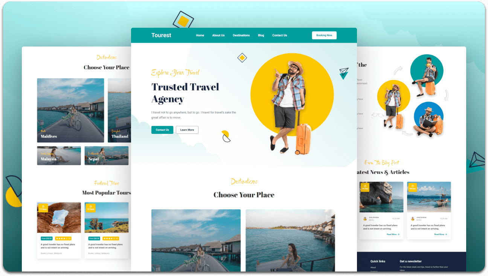

  ## Overview
Tourest is a sleek, user-friendly travel website designed to offer an engaging experience for users interested in exploring and booking travel options. Built with modern web technologies like HTML, CSS, and JavaScript, this project aims to provide a clean, responsive, and functional platform for showcasing destinations, providing information, and offering booking capabilities.

The website is fully responsive, ensuring seamless browsing on desktops, tablets, and mobile devices. It is ideal for developers and beginners looking for a reference in building travel websites or seeking inspiration for their own projects.

## Key Features
Fully Responsive: The website adapts seamlessly across all devices, from desktops to tablets and mobile phones.
Interactive UI: Provides users with an engaging and smooth navigation experience.
Attractive Design: Uses modern design principles with visually appealing UI components, including image carousels and sectioned content.
Booking Integration: Includes a mock-up of travel booking functionality, showing potential integration with real-world services.
Smooth Animations: Incorporates subtle animations for a more dynamic and professional feel.
Customizable: This project is free to use, and you can customize the content or structure according to your needs.

## Benefits
For Travelers: Users can explore and find travel destinations, check prices, and visualize booking options easily.
For Developers: A great learning tool for web development, with easy-to-understand code and a good example of building a responsive, interactive website.
Time-Saving: Ready-to-use templates, saving you time in the process of designing and developing a similar website.
Mobile Optimized: The design ensures that users on mobile devices get the same experience as those on desktops.

  
  
  

  

   
   

  <h2 align="center">Tourest - Travel website</h2>

  Tourest is fully responsive travel website,  Responsive for all devices, built using HTML, CSS, and JavaScript.

  <a href="https://travel-booking-website-two.vercel.app/"><strong>➥ Live Demo</strong></a>

 

### Demo Screeshots

## Conclusion
Tourest is an excellent example of a modern, responsive travel website that offers a user-friendly experience. Whether you're a developer looking to learn more about web design or a traveler wanting to explore new destinations, Tourest offers a robust solution for both. The project is free to use and open for modification, making it an ideal starting point for anyone interested in building a travel website.

This project is **free to use** and does not contains any license.
